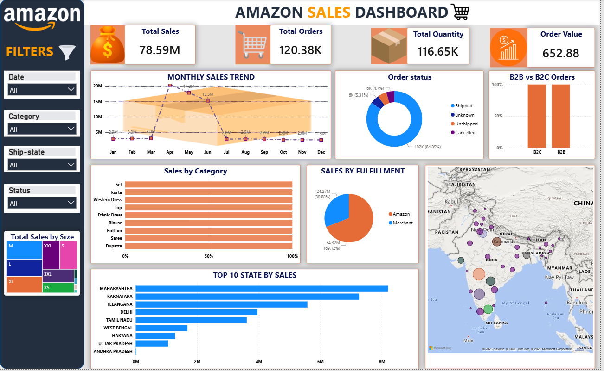

# 📊 Amazon Sales Dashboard

An end-to-end **Data Analytics Project** developed using **Python, SQL, Excel, and Power BI**. This project demonstrates the complete analytics workflow—from raw data cleaning and preprocessing to interactive dashboard development and business insights.

---

# 🚀 Live Dashboard

🔗 **Power BI Dashboard**

https://app.powerbi.com/view?r=eyJrIjoiYzZkNWQ1MjAtNWUzYi00ZjcxLWJmNzAtOTczNjZhNjNjNzhlIiwidCI6IjhkMjYwMDc5LTNiNDktNGRjZS1hNTk5LTVhZGY0MjUyNjA4MSJ9

---

# 📷 Dashboard Preview



---

# 📌 Project Overview

The objective of this project is to analyze Amazon sales data and build an interactive Power BI dashboard to monitor sales performance, customer orders, product categories, regional sales, and fulfillment insights.

The project follows a complete data analytics pipeline:

- Raw Dataset Collection
- Data Cleaning using Python
- Data Validation
- Data Modeling
- DAX Calculations
- Dashboard Development
- Business Insights

---

# 🧹 Data Cleaning (Python)

The raw dataset was cleaned and transformed using **Python (Pandas & NumPy)** before importing it into Power BI.

### Cleaning Steps

- Removed duplicate records
- Removed unnecessary columns
- Handled missing values
- Standardized state names
- Cleaned city names
- Removed leading and trailing spaces
- Fixed inconsistent text values
- Converted data types
- Formatted Date column
- Created clean dataset for reporting

### Python Libraries Used

- Pandas
- NumPy

---

# 📊 Data Modeling (Power BI)

Created relationships between tables using Calendar Table.

Added Date Intelligence columns:

- Date
- Month Name
- Month Number
- Quarter
- Year

---

# 📈 DAX Measures

Created business measures including:

- Total Sales
- Total Orders
- Total Quantity
- Average Order Value
- Last Month Sales
- Sales Growth %
- Order Growth %
- Quantity Growth %
- Average Order Growth %

---

# 📌 Dashboard KPIs

- 💰 Total Sales
- 📦 Total Orders
- 📦 Total Quantity
- 💵 Average Order Value

---

# 📊 Dashboard Visualizations

- Monthly Sales Trend
- Sales by Category
- Sales by Fulfillment
- Order Status Distribution
- B2B vs B2C Analysis
- Top 10 States by Sales
- Sales Map
- Product Size Distribution
- Interactive Slicers

---

# 🎯 Business Insights

- Maharashtra generated the highest sales.
- Amazon Fulfillment handled most orders.
- B2C orders dominated over B2B orders.
- Set and Kurta categories generated the highest revenue.
- Sales peaked during specific months.
- Dashboard allows dynamic filtering by Date, Category, State and Status.

---

# 🛠 Tools & Technologies

- Python
- Pandas
- NumPy
- SQL
- Microsoft Excel
- Power BI
- DAX
- Power Query

---

# 📂 Repository Structure

```
Amazon-Sales-Dashboard/
│── Amazon Sales Dashboard.pbix
│── Dashboard.png
│── amazon_cleaned_final.csv
│── Data Cleaning.ipynb
│── README.md
```

---

# 👨‍💻 Author

**Ibrahim Ansari**

🔗 GitHub: https://github.com/Ibrahim-223

---

# ⭐ If you like this project

Please consider giving this repository a **Star ⭐**